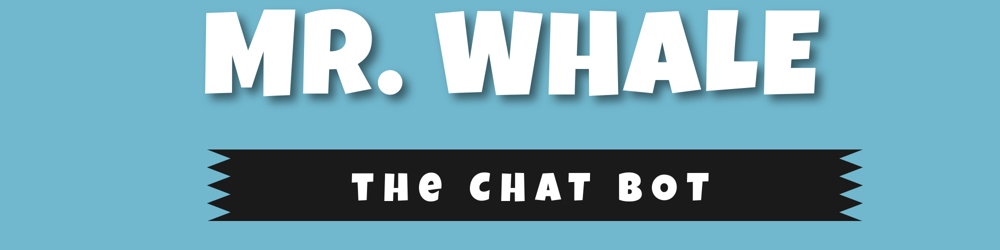
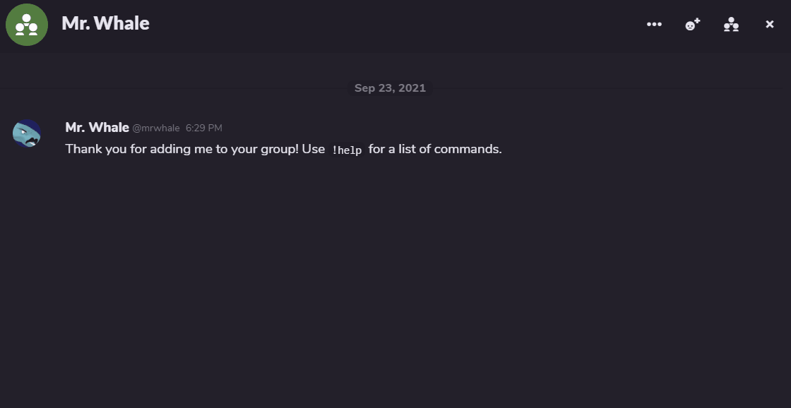
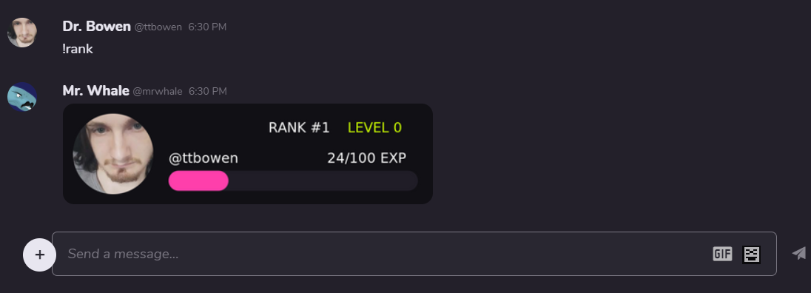

> Mr. Whale is an all-purpose chat bot loaded with dozens of awesome commands and features.

Feel free to add a star ⭐ to the repository to promote the project!

## Table of Contents

- [Features](#features)
- [Integrations](#integrations)
- [Screenshots](#screenshots)
- [Links](#links)
- [Maintainers](#maintainers)
- [Contributing](#contributing)
- [License](#license)

## Features

Some basic features include:

- ✉️ Support for commands in private and group chats.
- 🤖 Have conversations with cleverbot.
- 📣 Announce when users enter and leave chat.
- 🏆 EXP system for levelling up in group chats.
- ⚙️ Web Dashboard for managing Discord server configurations.

Mr. Whale has a lot of commands, with 6 main categories:

- 👻 **Fun**: `ascii`, `choose`, `conchshell`, `ship`, `gameidea`, `meme` and **7** more!
- 🎲 **Game**: `hangman`, `rockpaper` and `guess`!
- 🖨️ **Useful**: `calculator`, `translate`, `hastebin`, `wiki`, `advice` and `newyear`!
- 🔧 **Utility**: `help`, `info`, `langs`, `whois` and **3** more!
- 🎨 **Image** : `chocolatemilk`, `avatar`, `gun`, `avatarfusion`
- 👑 **Owner**: `eval`, `reload` and `cleverbot`!
- 🏆 **Level**: `rank`, `leaderboard`

[See the full command list](https://www.mrwhale.io/commands)

## Integrations

- [Game Jolt](https://github.com/mrwhale-io/mrwhale/tree/discord/packages/mrwhale-gamejolt)
- [Discord](https://github.com/mrwhale-io/mrwhale/tree/discord/packages/mrwhale-discord)

## Screenshots

Below are some screenshots of the bot in action

## Links

- [Website](https://www.mrwhale.io/)
- [Discord](https://discord.gg/wjBnkR4AUZ)
- [Github](https://github.com/mrwhale-io/mrwhale/)
- [Game Jolt](https://gamejolt.com/@mrwhale)

## Maintainers

[@ttbowen](https://github.com/ttbowen)

## Contributing

Feel free to dive in! [Open an issue](https://github.com/mrwhale-io/mrwhale/issues/new) or submit PRs.

This project follows the [Contributor Covenant](http://contributor-covenant.org/version/1/3/0/) Code of Conduct.

## License

[MIT](LICENSE) © Thomas Bowen
